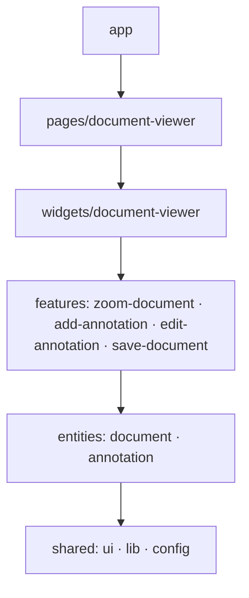

# Document Viewer

Просмотрщик многостраничных документов с текстовыми аннотациями. Тестовое задание.
Angular 22: standalone, zoneless, сигналы. Сторонних UI-библиотек и state-менеджеров нет.

- Просмотр документа, масштаб 25–300 % с шагом 25 %.
- Аннотации: добавить кликом по странице (или Enter — в центр страницы), перетащить за ручку
  (мышь, перо, касание) или сдвинуть стрелками, редактировать текст, удалить. Аннотация не уходит за край страницы.
- «Сохранить» выводит в консоль итоговый документ `{ id, name, pages, annotations }` — так требует ТЗ.

## Запуск

```bash
nvm use        # Node 24 LTS, см. .nvmrc
npm ci
npm start      # http://localhost:4200
npm run build
npm run lint   # ESLint + проверка архитектурных границ
```

Деплой на GitHub Pages: `npx ng deploy --base-href=/document-viewer/`.

## Архитектура: Feature-Sliced Design

Код разложен по слоям [FSD](https://feature-sliced.design/). Слой знает только о слоях ниже себя,
поэтому изменение в верхнем слое не может сломать нижний, а новая функциональность добавляется
новым слайсом, а не правкой существующих.

| Слой | Назначение | В проекте |
|---|---|---|
| `app` | инициализация приложения | bootstrap, провайдеры, маршруты, глобальные стили |
| `pages` | маршруты | `document-viewer` — загрузка документа по `:id`, экраны загрузки и ошибки |
| `widgets` | самостоятельные блоки UI | `document-viewer` — тулбар и страницы, граница состояния документа |
| `features` | действия пользователя | `zoom-document`, `add-annotation`, `edit-annotation`, `save-document` |
| `entities` | бизнес-сущности | `document` — модель, API, `PageView`; `annotation` — модель и стор |
| `shared` | переиспользуемое без бизнес-логики | UI-кит, drag-директива, геометрия, дизайн-токены, `API_URL` |



Внутри слайса код разбит на сегменты по назначению: `ui` — компоненты, `model` — состояние и типы,
`api` — обмен с бэкендом, `lib` — утилиты, `config` — конфигурация.

### Правила импорта (проверяет `npm run lint`)

- Импортировать можно только слои ниже. Слайсы одного слоя друг друга не импортируют.
- Снаружи слайса — только через его public API (`index.ts`) и алиасы: `@entities/annotation`,
  а не `@entities/annotation/model/annotations-store` и не `../../entities/...`.
- Внутри слайса — относительные импорты.
- Каждый файл принадлежит слою.

Правила описаны в `eslint.config.js` через `eslint-plugin-boundaries`: нарушение архитектуры — ошибка линтера,
а не замечание на ревью.

### Куда класть новый код

| Задача | Куда |
|---|---|
| Кнопка, поле, иконка без бизнес-смысла | `shared/ui` |
| Новая сущность (комментарий, пользователь) | `entities/<name>`: `model`, `api`, `ui` |
| Новое действие (поиск, печать, экспорт) | `features/<действие>` |
| Крупный самостоятельный блок (панель миниатюр) | `widgets/<name>` |
| Новый маршрут | `pages/<name>` и `app/app.routes.ts` |
