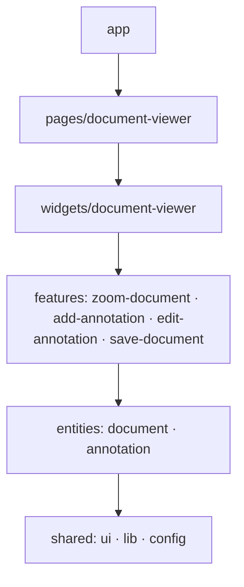

# Document Viewer

Просмотрщик многостраничных документов с текстовыми аннотациями. Тестовое задание.
Angular 22: standalone, zoneless, сигналы. Сторонних UI-библиотек и state-менеджеров нет.

- Просмотр документа, масштаб 25–300 % с шагом 25 %.
- Аннотации: добавить кликом по странице (или Enter — в центр страницы), перетащить за ручку
  (мышь, перо, касание) или сдвинуть стрелками, редактировать текст, удалить. Аннотация не уходит за край страницы.
- «Сохранить» выводит в консоль итоговый документ `{ id, name, pages, annotations }` — так требует ТЗ.

## Запуск

```bash
nvm use        # Node 24 LTS, см. .nvmrc
npm ci
npm start      # http://localhost:4200
npm run build
npm run lint   # ESLint + проверка архитектурных границ
```

Деплой на GitHub Pages: `npx ng deploy --base-href=/document-viewer/`.

## Архитектура: Feature-Sliced Design

Код разложен по слоям [FSD](https://feature-sliced.design/). Слой знает только о слоях ниже себя,
поэтому изменение в верхнем слое не может сломать нижний, а новая функциональность добавляется
новым слайсом, а не правкой существующих.

| Слой | Назначение | В проекте |
|---|---|---|
| `app` | инициализация приложения | bootstrap, провайдеры, маршруты, глобальные стили |
| `pages` | маршруты | `document-viewer` — загрузка документа по `:id`, экраны загрузки и ошибки |
| `widgets` | самостоятельные блоки UI | `document-viewer` — тулбар и страницы, граница состояния документа |
| `features` | действия пользователя | `zoom-document`, `add-annotation`, `edit-annotation`, `save-document` |
| `entities` | бизнес-сущности | `document` — модель, API, `PageView`; `annotation` — модель и стор |
| `shared` | переиспользуемое без бизнес-логики | UI-кит, drag-директива, геометрия, дизайн-токены, `API_URL` |



Внутри слайса код разбит на сегменты по назначению: `ui` — компоненты, `model` — состояние и типы,
`api` — обмен с бэкендом, `lib` — утилиты, `config` — конфигурация.

### Правила импорта (проверяет `npm run lint`)

- Импортировать можно только слои ниже. Слайсы одного слоя друг друга не импортируют.
- Снаружи слайса — только через его public API (`index.ts`) и алиасы: `@entities/annotation`,
  а не `@entities/annotation/model/annotations-store` и не `../../entities/...`.
- Внутри слайса — относительные импорты.
- Каждый файл принадлежит слою.

Правила описаны в `eslint.config.js` через `eslint-plugin-boundaries`: нарушение архитектуры — ошибка линтера,
а не замечание на ревью.

### Куда класть новый код

| Задача | Куда |
|---|---|
| Кнопка, поле, иконка без бизнес-смысла | `shared/ui` |
| Новая сущность (комментарий, пользователь) | `entities/<name>`: `model`, `api`, `ui` |
| Новое действие (поиск, печать, экспорт) | `features/<действие>` |
| Крупный самостоятельный блок (панель миниатюр) | `widgets/<name>` |
| Новый маршрут | `pages/<name>` и `app/app.routes.ts` |

## Ключевые решения

**Состояние живёт ровно столько, сколько открыт документ.** Сторы аннотаций, масштаба и режима размещения
предоставляются в `widgets/document-viewer`, а страница рендерит виджет только когда документ загружен.
При смене `:id` ресурс сбрасывает значение, и виджет пересоздаётся вместе со сторами. Аннотации одного документа
не могут попасть в другой, кнопки тулбара недоступны без документа, ручной «сброс» не нужен. Это и есть причина
существования слоя `widgets`: он задаёт границу состояния и готов к повторному использованию (превью в модальном окне,
сравнение двух документов).

**Сторы на сигналах.** Приватный `signal`, наружу — `asReadonly()` и `computed`, изменения — только методами,
обновления иммутабельные: у нетронутых аннотаций сохраняется identity, и перерисовываются только изменившиеся.
Сторы виджета объявлены через `@Service({ autoProvided: false })`: вне виджета инъекция падает явно,
а не создаёт тихий root-синглтон.

**Страница как compound component.** `PageView` рендерит страницу в масштабе и проецирует внутрь оверлеи.
Проецируемые компоненты получают через DI абстракцию `PageSurface`: номер страницы, размер и перевод координат
указателя в координаты страницы. Координаты аннотаций хранятся в базовой системе страницы (ширина 800) и не зависят
от масштаба, а масштаб при пересчёте берётся из фактического размера на экране — поэтому пересчёт верен и во время
анимации zoom, и при прокрутке посреди перетаскивания.

**Перетаскивание.** Generic-директива `PointerDrag` (pointer capture, отмена на `pointercancel`) отдаёт координаты
указателя. `AnnotationEditor` держит позицию перетаскивания локально и сообщает стору одно событие `move` при
отпускании, и только если аннотация действительно сдвинулась. Стор получает доменные события, а не 60 обновлений
в секунду, — задел для undo и автосохранения.

**Сохранение за абстракцией.** `SaveDocumentApi` — единственное место, которое знает, что «сохранение» — это `console.log`.
Замена на HTTP-запрос не затронет компоненты. Формат payload собирает функция в `features/save-document/model`:
сущности `document` и `annotation` друг о друге не знают.

**Дизайн-токены.** Цвета, тени, радиусы и тайминги — CSS-переменные в `shared/ui/theme/tokens.scss`.
Все переходы завязаны на один токен длительности, который обнуляется при `prefers-reduced-motion`.

## Angular 22: что используется

- **OnPush по умолчанию** — `changeDetection` в компонентах не указывается.
- **`rxResource`** (stable с 22.0) — загрузка документа. Шаблон проверяет `hasValue` → `isLoading` → `error`:
  `value()` бросает исключение в состоянии ошибки, а повторная загрузка идёт со статусом `reloading`.
- **`@Service()`** вместо `@Injectable({ providedIn: 'root' })`.
- **`HttpClient` доступен в root по умолчанию и работает на fetch** — `provideHttpClient()` не нужен.
- **`NgOptimizedImage`** — первая страница грузится с высоким приоритетом, остальные лениво.
- Сигнальные `input` / `output` / `viewChild`, control flow, `@let`, host bindings в метаданных компонента.

Сознательно не используются: Signal Forms (stable, но здесь одно текстовое поле без валидации),
`@angular/aria` (новая зависимость ради одной группы кнопок), `injectAsync` (нечего загружать лениво),
`debounced` (experimental), `@boundary` (developer preview).

## Ограничения и следующие шаги

- Аннотации хранятся в памяти: по ТЗ сохранение — вывод в консоль. Для persistence достаточно реализовать
  `SaveDocumentApi` через HTTP и отдавать аннотации вместе с документом в `DocumentApi`.
- Ответ API не проверяется в рантайме. При реальном бэкенде — схема (Zod или Standard Schema) в `DocumentApi`.
- До загрузки изображения страница имеет пропорции A4. Точный размер лучше отдавать из API.
- Все страницы рендерятся сразу, лениво грузятся только изображения. Для сотен страниц — виртуализация (CDK Virtual Scroll).
- Unit-тесты: раннер настроен (Vitest через `@angular/build:unit-test`), спецификаций пока нет.
  Архитектура под них готова: сторы — обычные классы, а компоненты зависят от абстракций
  (`PageSurface`, `SaveDocumentApi`), которые подменяются через DI.
